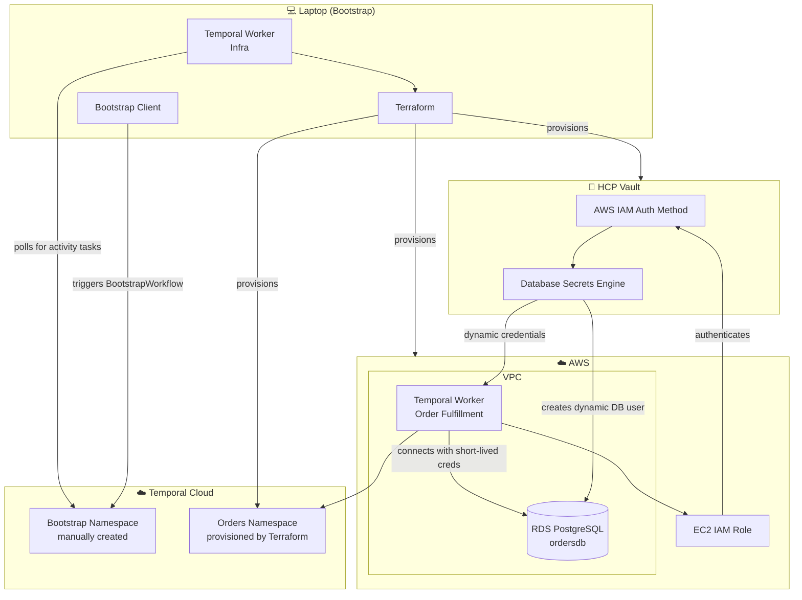
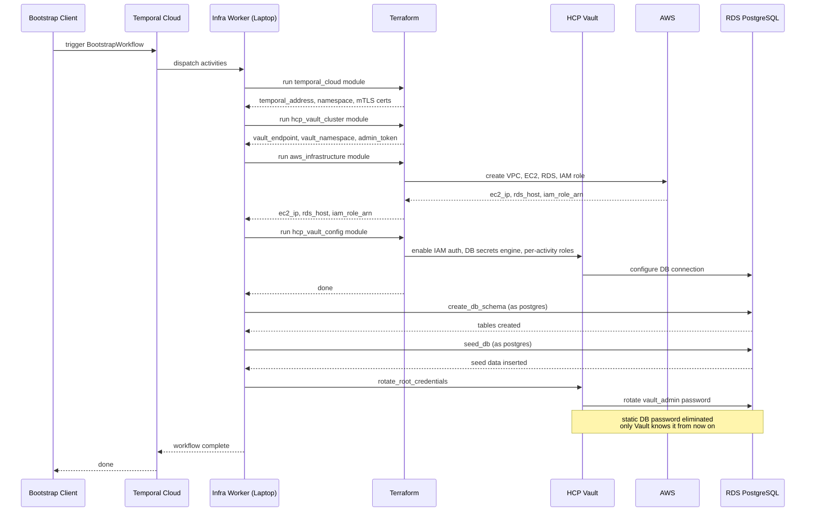
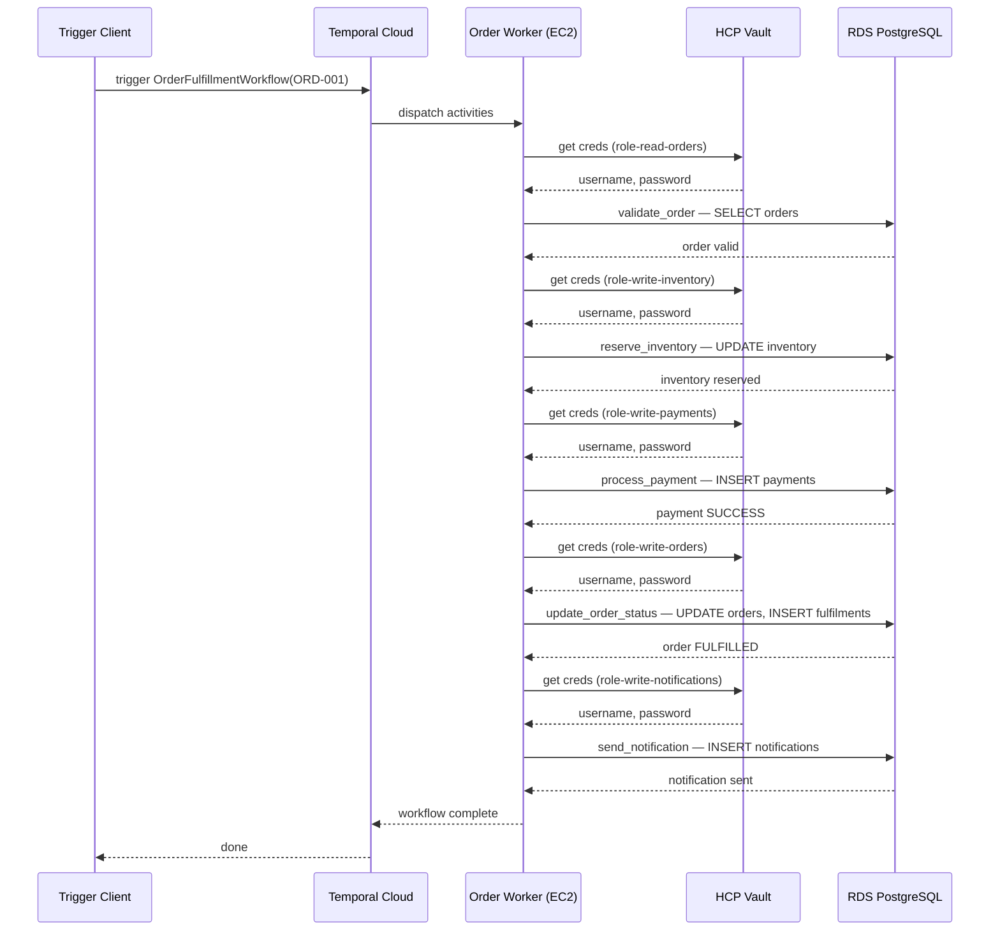
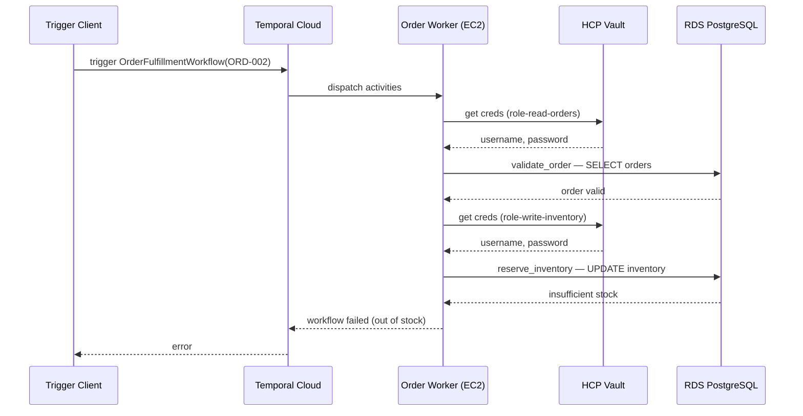
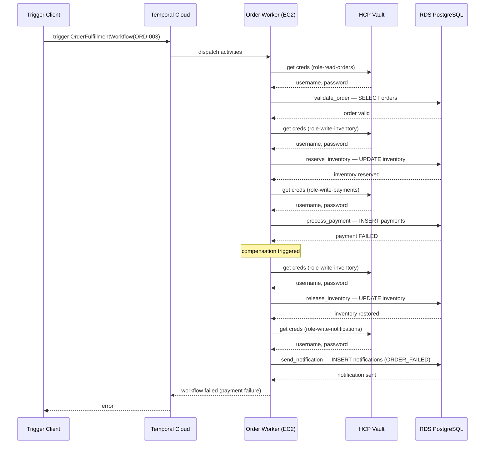
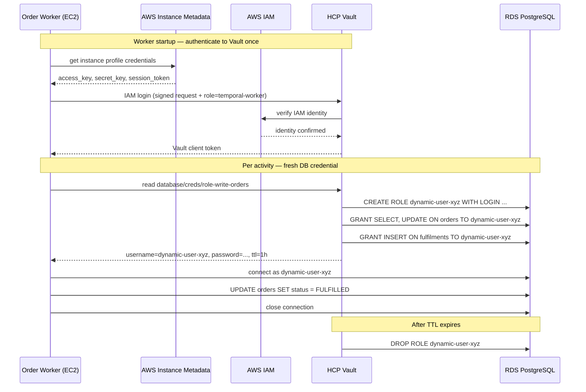

# Temporal Cloud + HCP Vault + AWS Terraform Demo

**Status: End-to-End Working**

A production-grade demonstration of zero-static-credentials infrastructure using:
- **Temporal Cloud** for workflow orchestration
- **HCP Vault** for secrets management and dynamic credentials
- **AWS** for compute and database infrastructure
- **Terraform** for Infrastructure as Code

## Overview

This project demonstrates how to build a secure, credential-free system where:

1. **Bootstrap Workflow** (runs on laptop) orchestrates all infrastructure provisioning via Terraform activities
2. **Order Fulfillment Workflow** (runs on EC2) processes orders using per-activity dynamic database credentials from Vault
3. **EC2 IAM Authentication** eliminates static credentials — workers authenticate to Vault using their IAM role
4. **Vault Root Credential Rotation** removes the static database admin password after initial setup

## System Architecture



## Bootstrap Workflow



## Order Fulfillment Workflow

### Happy Path (ORD-001)



### Out of Stock (ORD-002)



### Payment Failure with Compensation (ORD-003)



## Vault Dynamic Credential Flow

How the EC2 order worker gets a fresh, short-lived database credential for each activity.



## Key Features

- **Zero Static Credentials**: EC2 workers use IAM role for Vault authentication — no hardcoded secrets anywhere
- **Dynamic Secrets**: Each activity gets fresh, short-lived database credentials scoped to its exact privilege set
- **Least-Privilege per Activity**: Each activity has its own Vault role (`role-read-orders`, `role-write-inventory`, `role-write-payments`, etc.)
- **Terraform Orchestration**: Infrastructure provisioning is a Temporal workflow, not a shell script
- **Automatic Code Deployment**: EC2 worker pulls latest code from GitHub on every service restart via `ExecStartPre`
- **Compensation Logic**: Payment failure triggers inventory release automatically
- **Production-Ready**: mTLS authentication to Temporal Cloud, Vault root credential rotation, SSM-only EC2 access (no SSH keys)

## Prerequisites

- HCP account with Vault
- Temporal Cloud account (with one manually-created namespace)
- AWS account
- Python 3.12 + uv
- Terraform
- GitHub account (for code deployment to EC2)

## Getting Started

See `.env.example` for required environment variables.

### 1. Bootstrap the infrastructure

Start the infra worker on your laptop and trigger the bootstrap workflow:

```bash
uv run python -m client.start_infra_worker &
uv run python -m client.start_bootstrap_workflow
```

This provisions everything end-to-end: Temporal namespace, HCP Vault cluster, AWS VPC/EC2/RDS, Vault IAM auth + DB secrets engine, database schema, seed data, and root credential rotation.

### 2. Trigger an order fulfillment workflow

From the EC2 instance (via SSM Session Manager):

```bash
uv run python -m client.trigger_order ORD-001   # happy path
uv run python -m client.trigger_order ORD-002   # out-of-stock scenario
uv run python -m client.trigger_order ORD-003   # payment failure + compensation
```

## Test Scenarios

| Order ID | Scenario | Expected Outcome |
|----------|----------|-----------------|
| ORD-001  | Happy path | Order fulfilled, all 5 activities succeed |
| ORD-002  | Out of stock | Fails at `reserve_inventory`, no compensation needed |
| ORD-003  | Payment failure | Fails at `process_payment`, `release_inventory` runs as compensation |

## Project Structure

```
.
├── terraform/modules/              # Terraform modules (independent, run as Temporal activities)
│   ├── temporal_cloud/             # Provisions Temporal Cloud namespace + mTLS certs
│   ├── hcp_vault_cluster/          # Provisions HCP Vault cluster + HVN
│   ├── aws_infrastructure/         # Provisions VPC, EC2, RDS, IAM role + SSM policy
│   └── hcp_vault_config/           # Configures Vault (IAM auth, DB engine, per-activity roles)
├── workers/
│   ├── common/
│   │   └── temporal_client.py      # Shared mTLS Temporal Cloud connection
│   ├── infra_worker/               # Bootstrap workflow & activities (runs on laptop)
│   │   ├── workflows/bootstrap.py  # Orchestrates all 7 bootstrap steps
│   │   ├── activities/bootstrap_activities.py
│   │   └── terraform_runner.py
│   └── order_worker/               # Order fulfillment workflow & activities (runs on EC2)
│       ├── workflows/order_fulfillment.py
│       ├── activities/order_activities.py
│       └── vault_client.py         # Vault IAM auth & dynamic credential fetching
├── client/
│   ├── start_infra_worker.py       # Starts the bootstrap worker on laptop
│   ├── start_bootstrap_workflow.py # Triggers the BootstrapWorkflow
│   └── trigger_order.py            # Triggers an OrderFulfillmentWorkflow by order ID
└── connect-ec2.sh                  # Opens an SSM session to the EC2 worker instance
```

## Current Status

### Bootstrap Workflow ✅
All 7 bootstrap steps working end-to-end with full HCP Vault cluster provisioning (`PROVISION_HCP_VAULT_CLUSTER=true`):
- Fresh random DB admin password generated on each run (RDS-compatible charset)
- Schema creation and seeding are idempotent (`CREATE TABLE IF NOT EXISTS`, `INSERT ... ON CONFLICT DO NOTHING`)
- Vault root credential rotation eliminates the static password after setup
- Safe to rerun — Terraform only applies changes, existing resources are preserved

> **Not yet tested:** the `PROVISION_HCP_VAULT_CLUSTER=false` path (using a pre-existing HCP Vault cluster). Set `PROVISION_HCP_VAULT_CLUSTER=false` and provide `HCP_VAULT_ADDR`, `HCP_VAULT_NAMESPACE`, and `HCP_VAULT_TOKEN` to skip cluster provisioning and reuse an existing cluster.

### Order Fulfillment Workflow ✅
All 3 scenarios verified working:
- Happy path (ORD-001): order validated, inventory reserved, payment processed, order fulfilled, notification sent
- Out-of-stock (ORD-002): fails at reservation, no partial state left
- Payment failure (ORD-003): fails at payment, compensation releases inventory automatically

**Compensation (rollback) activities** exist for all Terraform modules (`destroy_*` activities) but are currently commented out in the bootstrap workflow. Wiring up automatic rollback on failure is a future task.

## Security Notes & Future Work

- **Temporal event history**: Activity inputs/outputs (mTLS certs, admin tokens) are stored in plain text in Temporal Cloud. Next step: Vault Transit data converter to encrypt all payloads.
- **Terraform state**: Local `.tfstate` files contain sensitive values. Next step: migrate to Terraform Cloud for remote state with encryption and locking.
- **Bootstrap env vars**: `HCP_CLIENT_SECRET`, `AWS_SECRET_ACCESS_KEY`, etc. live in the shell environment. Next step: move bootstrap triggering into a CI/CD pipeline (e.g. GitHub Actions) and fetch all credentials from Vault at runtime, eliminating the need for manual secrets on the operator's machine.
- **Bootstrap rollback**: Destroy activities are implemented but not wired up. Full automatic rollback on bootstrap failure is a future task.
- **Existing Vault cluster path**: The `PROVISION_HCP_VAULT_CLUSTER=false` flow (reusing a pre-existing HCP Vault cluster) is implemented but not yet tested end-to-end.

---

## Development

I built this project with Claude as an AI pair-programming assistant. Claude helped with brainstorming, code suggestions, refactoring, and documentation, while I directed the work, reviewed the outputs, and made the final implementation decisions.

## License

This project is licensed under the MIT License - see the [LICENSE](./LICENSE) file for details.
