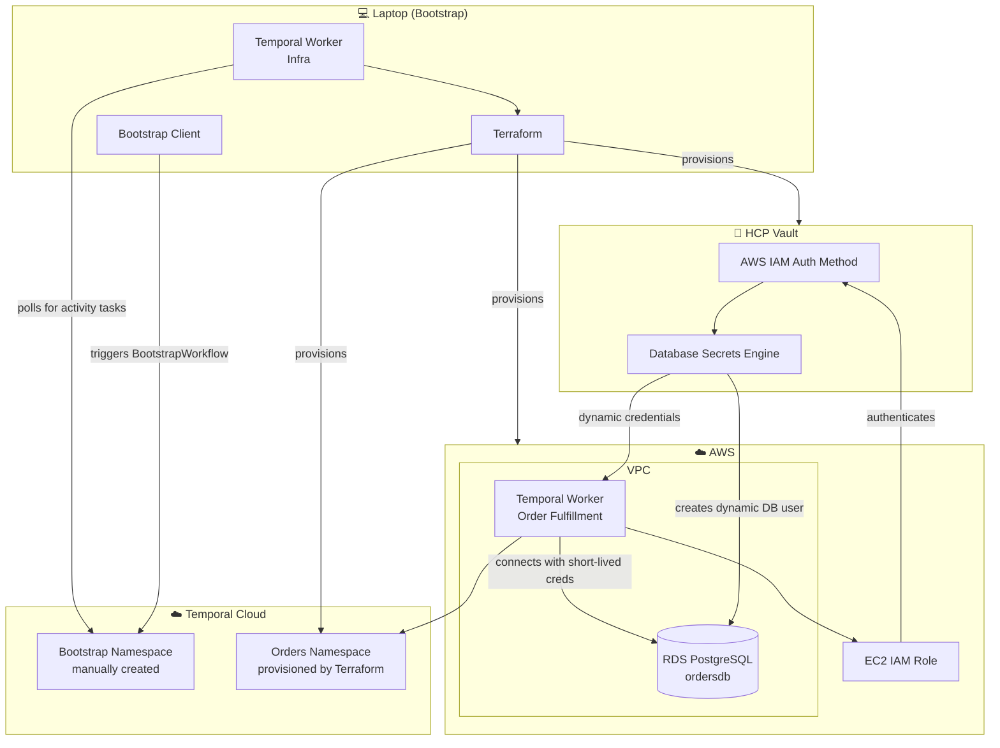

# System Architecture

```mermaid
graph TB
    subgraph Laptop["💻 Laptop (Bootstrap)"]
        IW[Temporal Worker<br/>Infra]
        BC[Bootstrap Client]
        TF[Terraform]
    end

    subgraph TC["☁️ Temporal Cloud"]
        BNS[Bootstrap Namespace<br/>manually created]
        ONS[Orders Namespace<br/>provisioned by Terraform]
    end

    subgraph HCP["🔐 HCP Vault"]
        IAM[AWS IAM Auth Method]
        DBE[Database Secrets Engine]
    end

    subgraph AWS["☁️ AWS"]
        subgraph VPC["VPC"]
            EC2[Temporal Worker<br/>Order Fulfillment]
            RDS[(RDS PostgreSQL<br/>ordersdb)]
        end
        IAMRole[EC2 IAM Role]
    end

    BC -->|triggers BootstrapWorkflow| BNS
    IW -->|polls for activity tasks| BNS
    IW --> TF
    TF -->|provisions| ONS
    TF -->|provisions| HCP
    TF -->|provisions| AWS

    EC2 --> ONS
    EC2 --> IAMRole
    IAMRole -->|authenticates| IAM
    IAM --> DBE
    DBE -->|dynamic credentials| EC2
    DBE -->|creates dynamic DB user| RDS
    EC2 -->|connects with short-lived creds| RDS
```
