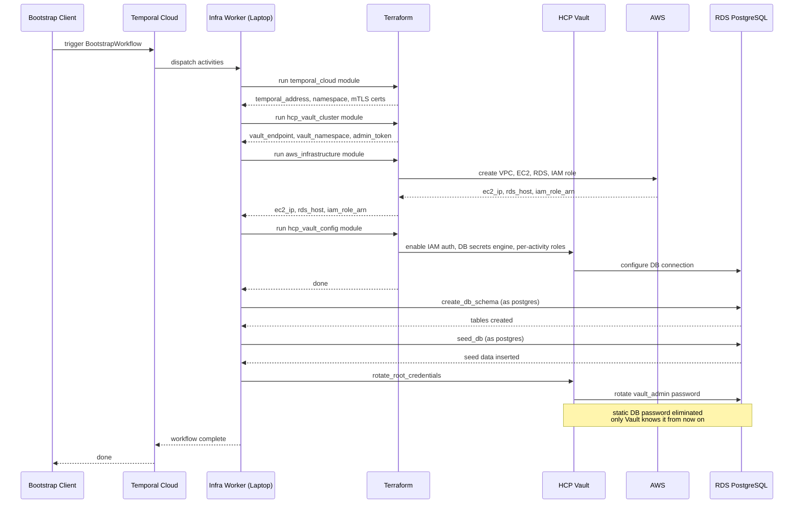

# Bootstrap Workflow

```mermaid
sequenceDiagram
    participant BC as Bootstrap Client
    participant TC as Temporal Cloud
    participant IW as Infra Worker (Laptop)
    participant TF as Terraform
    participant HCP as HCP Vault
    participant AWS as AWS
    participant RDS as RDS PostgreSQL

    BC->>TC: trigger BootstrapWorkflow
    TC->>IW: dispatch activities

    IW->>TF: run temporal_cloud module
    TF-->>IW: temporal_address, namespace, mTLS certs

    IW->>TF: run hcp_vault_cluster module
    TF-->>IW: vault_endpoint, vault_namespace, admin_token

    IW->>TF: run aws_infrastructure module
    TF->>AWS: create VPC, EC2, RDS, IAM role
    AWS-->>TF: ec2_ip, rds_host, iam_role_arn
    TF-->>IW: ec2_ip, rds_host, iam_role_arn

    IW->>TF: run hcp_vault_config module
    TF->>HCP: enable IAM auth, DB secrets engine, per-activity roles
    HCP->>RDS: configure DB connection
    TF-->>IW: done

    IW->>RDS: create_db_schema (as postgres)
    RDS-->>IW: tables created

    IW->>RDS: seed_db (as postgres)
    RDS-->>IW: seed data inserted

    IW->>HCP: rotate_root_credentials
    HCP->>RDS: rotate vault_admin password
    Note over HCP,RDS: static DB password eliminated<br/>only Vault knows it from now on

    IW-->>TC: workflow complete
    TC-->>BC: done
```
