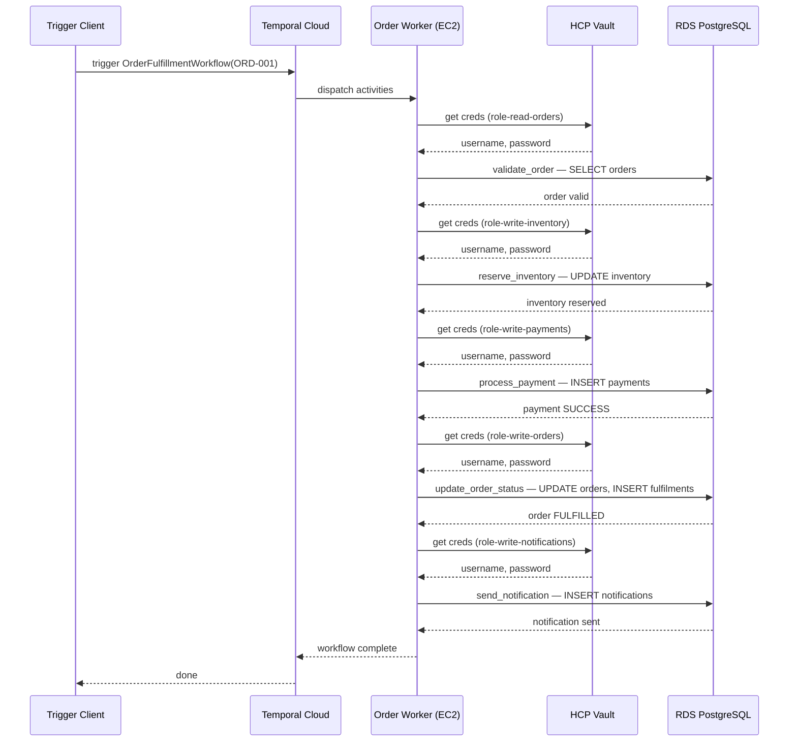
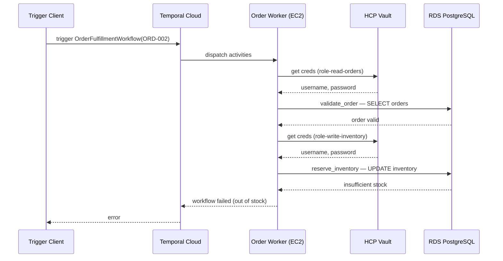
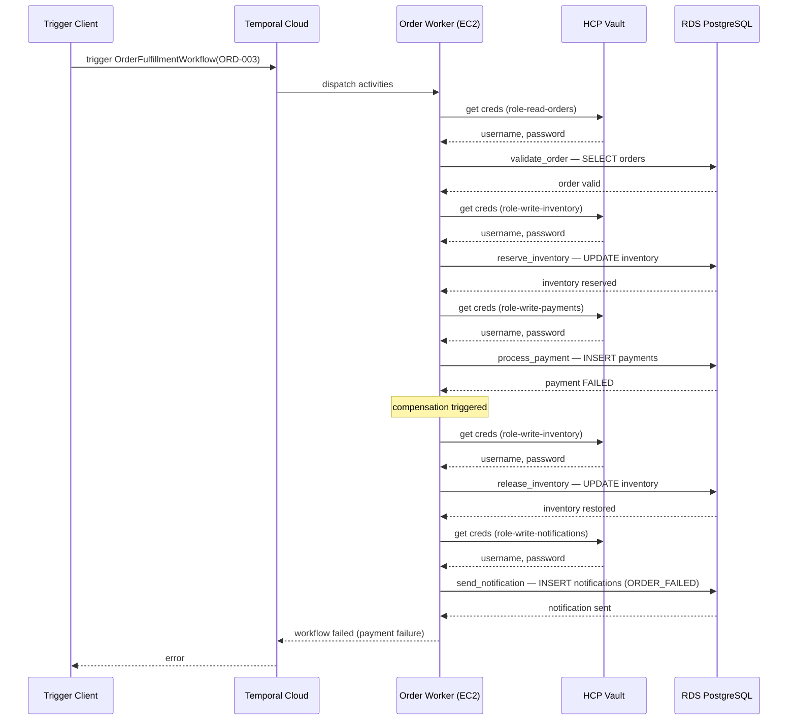

# Order Fulfillment Workflow

## Happy Path (ORD-001)

```mermaid
sequenceDiagram
    participant C as Trigger Client
    participant TC as Temporal Cloud
    participant OW as Order Worker (EC2)
    participant V as HCP Vault
    participant RDS as RDS PostgreSQL

    C->>TC: trigger OrderFulfillmentWorkflow(ORD-001)
    TC->>OW: dispatch activities

    OW->>V: get creds (role-read-orders)
    V-->>OW: username, password
    OW->>RDS: validate_order — SELECT orders
    RDS-->>OW: order valid

    OW->>V: get creds (role-write-inventory)
    V-->>OW: username, password
    OW->>RDS: reserve_inventory — UPDATE inventory
    RDS-->>OW: inventory reserved

    OW->>V: get creds (role-write-payments)
    V-->>OW: username, password
    OW->>RDS: process_payment — INSERT payments
    RDS-->>OW: payment SUCCESS

    OW->>V: get creds (role-write-orders)
    V-->>OW: username, password
    OW->>RDS: update_order_status — UPDATE orders, INSERT fulfilments
    RDS-->>OW: order FULFILLED

    OW->>V: get creds (role-write-notifications)
    V-->>OW: username, password
    OW->>RDS: send_notification — INSERT notifications
    RDS-->>OW: notification sent

    OW-->>TC: workflow complete
    TC-->>C: done
```

## Out of Stock (ORD-002)

```mermaid
sequenceDiagram
    participant C as Trigger Client
    participant TC as Temporal Cloud
    participant OW as Order Worker (EC2)
    participant V as HCP Vault
    participant RDS as RDS PostgreSQL

    C->>TC: trigger OrderFulfillmentWorkflow(ORD-002)
    TC->>OW: dispatch activities

    OW->>V: get creds (role-read-orders)
    V-->>OW: username, password
    OW->>RDS: validate_order — SELECT orders
    RDS-->>OW: order valid

    OW->>V: get creds (role-write-inventory)
    V-->>OW: username, password
    OW->>RDS: reserve_inventory — UPDATE inventory
    RDS-->>OW: insufficient stock

    OW-->>TC: workflow failed (out of stock)
    TC-->>C: error
```

## Payment Failure with Compensation (ORD-003)

```mermaid
sequenceDiagram
    participant C as Trigger Client
    participant TC as Temporal Cloud
    participant OW as Order Worker (EC2)
    participant V as HCP Vault
    participant RDS as RDS PostgreSQL

    C->>TC: trigger OrderFulfillmentWorkflow(ORD-003)
    TC->>OW: dispatch activities

    OW->>V: get creds (role-read-orders)
    V-->>OW: username, password
    OW->>RDS: validate_order — SELECT orders
    RDS-->>OW: order valid

    OW->>V: get creds (role-write-inventory)
    V-->>OW: username, password
    OW->>RDS: reserve_inventory — UPDATE inventory
    RDS-->>OW: inventory reserved

    OW->>V: get creds (role-write-payments)
    V-->>OW: username, password
    OW->>RDS: process_payment — INSERT payments
    RDS-->>OW: payment FAILED

    Note over OW: compensation triggered
    OW->>V: get creds (role-write-inventory)
    V-->>OW: username, password
    OW->>RDS: release_inventory — UPDATE inventory
    RDS-->>OW: inventory restored

    OW->>V: get creds (role-write-notifications)
    V-->>OW: username, password
    OW->>RDS: send_notification — INSERT notifications (ORDER_FAILED)
    RDS-->>OW: notification sent

    OW-->>TC: workflow failed (payment failure)
    TC-->>C: error
```
