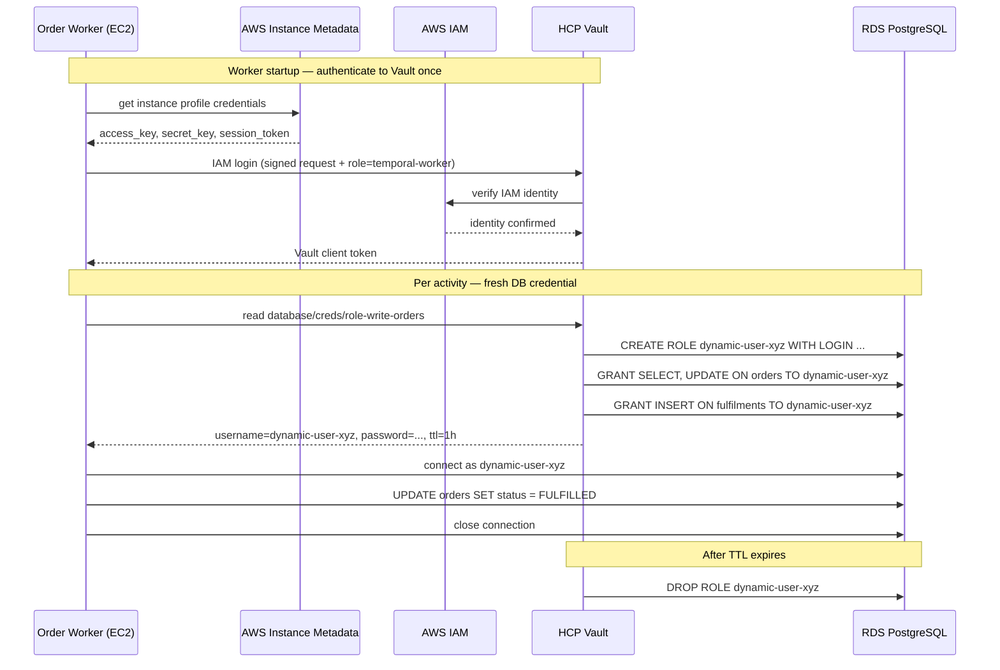

# Vault Dynamic Credential Flow

How the EC2 order worker gets a fresh, short-lived database credential for each activity.

```mermaid
sequenceDiagram
    participant OW as Order Worker (EC2)
    participant IMDS as AWS Instance Metadata
    participant IAM as AWS IAM
    participant V as HCP Vault
    participant RDS as RDS PostgreSQL

    Note over OW,V: Worker startup — authenticate to Vault once
    OW->>IMDS: get instance profile credentials
    IMDS-->>OW: access_key, secret_key, session_token
    OW->>V: IAM login (signed request + role=temporal-worker)
    V->>IAM: verify IAM identity
    IAM-->>V: identity confirmed
    V-->>OW: Vault client token

    Note over OW,RDS: Per activity — fresh DB credential
    OW->>V: read database/creds/role-write-orders
    V->>RDS: CREATE ROLE dynamic-user-xyz WITH LOGIN ...
    V->>RDS: GRANT SELECT, UPDATE ON orders TO dynamic-user-xyz
    V->>RDS: GRANT INSERT ON fulfilments TO dynamic-user-xyz
    V-->>OW: username=dynamic-user-xyz, password=..., ttl=1h
    OW->>RDS: connect as dynamic-user-xyz
    OW->>RDS: UPDATE orders SET status = FULFILLED
    OW->>RDS: close connection

    Note over V,RDS: After TTL expires
    V->>RDS: DROP ROLE dynamic-user-xyz
```
